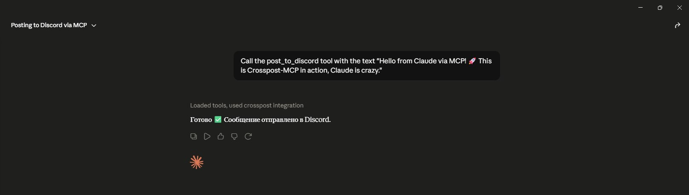

# crosspost-mcp

**MCP server that lets AI agents cross-post content to Telegram, Discord, Mastodon, Bluesky, and Reddit — using free APIs only.**

[](https://www.python.org/downloads/)
[](LICENSE)
[](https://modelcontextprotocol.io/)
[](https://github.com/jlowin/fastmcp)

## Why crosspost-mcp

AI agents can now draft, research, and refine content end-to-end — but publishing to social media is still the manual bottleneck. **crosspost-mcp** closes that gap by exposing posting tools over the [Model Context Protocol](https://modelcontextprotocol.io/), so Claude Desktop, Cursor, and other MCP-compatible clients can publish on your behalf with a single prompt.

## Demo

Claude calls `post_to_discord` and the message appears in your channel instantly:



## Features

- **Free APIs only** — no paid SaaS middlemen; Telegram Bot API, Discord webhooks, and upcoming platform APIs are all free-tier friendly
- **Async parallel posting** — `post_to_all` fans out to every configured platform concurrently
- **Type-hinted** — full Python type annotations on tools and platform modules
- **Dataclass configs** — frozen dataclasses per platform with clear missing-variable errors
- **Easy to extend** — add a new platform by dropping a module in `platforms/` and registering a tool

## Supported Platforms

| Platform | Status | Free Tier | Notes |
|----------|--------|-----------|-------|
| Telegram | ✅ v0.1.0 | unlimited | Bot API |
| Discord | ✅ v0.1.0 | unlimited | webhooks |
| Mastodon | 🚧 v0.2.0 | unlimited | requires instance |
| Bluesky | 🚧 v0.3.0 | unlimited | App Password |
| Reddit | 🚧 v0.4.0 | rate-limited | OAuth |

## 🚀 Quick Start

### Clone & install

```bash
git clone https://github.com/Aleksey-Panf/crosspost-mcp.git
cd crosspost-mcp
pip install -e .
```

### Setup credentials

Copy the example env file and fill in your tokens:

```bash
cp .env.example .env
```

Edit `.env` with your Telegram bot token, Discord webhook URL, and any other platform credentials you plan to use.

### Add to Claude Desktop

Open your Claude Desktop MCP config:

- **macOS:** `~/Library/Application Support/Claude/claude_desktop_config.json`
- **Windows:** `%APPDATA%\Claude\claude_desktop_config.json`

Add the server entry (adjust the path to your clone):

```json
{
  "mcpServers": {
    "crosspost-mcp": {
      "command": "crosspost-mcp",
      "cwd": "/path/to/crosspost-mcp",
      "env": {
        "TELEGRAM_BOT_TOKEN": "your_bot_token",
        "TELEGRAM_CHAT_ID": "your_chat_id",
        "DISCORD_WEBHOOK_URL": "https://discord.com/api/webhooks/..."
      }
    }
  }
}
```

> **Tip:** If `crosspost-mcp` is not on your PATH, use the full path to the executable inside your virtualenv, or point `command` to `python` with `args: ["-m", "crosspost_mcp.server"]`.

Cursor users can add the same block under **Settings → MCP → Add server**.

### Restart Claude Desktop

Fully quit and relaunch Claude Desktop (or reload MCP in Cursor). The `post_to_telegram`, `post_to_discord`, and `post_to_all` tools should appear in the tool list.

## Usage Examples

Give your AI agent natural-language instructions — it picks the right MCP tool automatically.

**Example 1 — Discord only**

> Post to Discord: "v0.1.0 is live — crosspost-mcp now supports Telegram and Discord webhooks."

Claude calls `post_to_discord` with the message text and returns the Discord `message_id` and `channel_id`.

**Example 2 — Telegram only**

> Announce on Telegram that we shipped parallel cross-posting. Use bold for the version number.

Claude calls `post_to_telegram` with HTML formatting (`<b>v0.1.0</b>`) and confirms the `message_id`.

**Example 3 — Cross-post everywhere**

> Cross-post this to all platforms: "New blog post is up — link in bio."

Claude calls `post_to_all`, which posts to Telegram and Discord in parallel and returns a combined status (`ok`, `partial`, or `error`) with per-platform results.

## 🔧 Tool Reference

### `post_to_telegram`

Post a message to the configured Telegram channel.

| | |
|---|---|
| **Signature** | `post_to_telegram(text: str) -> dict` |
| **Arguments** | `text` — message body (max 4,096 chars). Supports HTML: `<b>`, `<i>`, `<code>`, `<a href="">` |
| **Returns** | Platform result dict |

**Example response:**

```json
{
  "platform": "telegram",
  "status": "ok",
  "message_id": 42,
  "chat_id": -1001234567890
}
```

### `post_to_discord`

Post a message to the configured Discord channel via webhook.

| | |
|---|---|
| **Signature** | `post_to_discord(text: str) -> dict` |
| **Arguments** | `text` — message content (max 2,000 chars). Supports Discord markdown: `**bold**`, `*italic*`, `` `code` ``, ` ```block``` ` |
| **Returns** | Platform result dict |

**Example response:**

```json
{
  "platform": "discord",
  "status": "ok",
  "message_id": "1234567890123456789",
  "channel_id": "9876543210987654321"
}
```

### `post_to_all`

Cross-post the same message to all configured platforms in parallel.

| | |
|---|---|
| **Signature** | `post_to_all(text: str) -> dict` |
| **Arguments** | `text` — message text. Platforms enforce their own length limits independently |
| **Returns** | Aggregated result with overall status and per-platform entries |

Individual platform failures do not abort the others. Each failure is reported with `status: "error"` and an `error` message.

**Example response:**

```json
{
  "status": "ok",
  "results": [
    {
      "platform": "telegram",
      "status": "ok",
      "message_id": 42,
      "chat_id": -1001234567890
    },
    {
      "platform": "discord",
      "status": "ok",
      "message_id": "1234567890123456789",
      "channel_id": "9876543210987654321"
    }
  ]
}
```

## Getting Credentials

### Telegram

1. Open Telegram and message [@BotFather](https://t.me/BotFather).
2. Send `/newbot`, follow the prompts, and copy the **bot token**.
3. Add the bot as an **admin** to your target channel with **Post Messages** permission.
4. Get the **chat ID**:
   - For public channels, use `@channelname` (include the `@`).
   - For private channels, forward a channel message to [@userinfobot](https://t.me/userinfobot) or call `getUpdates` on the Bot API after posting in the channel.
5. Set `TELEGRAM_BOT_TOKEN` and `TELEGRAM_CHAT_ID` in your `.env`.

### Discord

1. Open your Discord server and go to the target **channel**.
2. Click the gear icon → **Integrations** → **Webhooks** → **New Webhook**.
3. Name the webhook, select the channel, and click **Copy Webhook URL**.
4. Set `DISCORD_WEBHOOK_URL` in your `.env`.

No bot application or OAuth flow required — webhooks are the simplest path for AI agent posting.

## Project Structure

```
crosspost-mcp/
├── assets/                          # Screenshots and demo images
├── src/
│   └── crosspost_mcp/
│       ├── __init__.py
│       ├── config.py                # Dataclass configs loaded from .env
│       ├── server.py                # FastMCP server and tool definitions
│       └── platforms/
│           ├── __init__.py
│           ├── telegram.py          # Telegram Bot API client
│           └── discord.py           # Discord webhook client
├── tests/
├── .env.example                     # Credential template
├── pyproject.toml
└── README.md
```

## Roadmap

- [x] Telegram support
- [x] Discord support
- [x] Parallel cross-posting
- [ ] Mastodon support (v0.2.0)
- [ ] Bluesky support (v0.3.0)
- [ ] Reddit support (v0.4.0)
- [ ] Media/image attachments
- [ ] Scheduled posting

## Contributing

Contributions are welcome — bug reports, platform modules, and documentation improvements all help. Open an [issue](https://github.com/Aleksey-Panf/crosspost-mcp/issues) to discuss larger changes before submitting a pull request.

## Custom MCP Development

I build production-ready MCP servers on demand for custom platforms and workflows.

- Delivery: 3–7 days
- Workflow: Async-only, no calls
- Payment: USDT
- Contact: [Telegram @AlexAi14](https://t.me/AlexAi14) or [open a GitHub issue](https://github.com/Aleksey-Panf/crosspost-mcp/issues)

## License

MIT — see [LICENSE](LICENSE) for details.

---

**Topics:** `mcp` · `model-context-protocol` · `fastmcp` · `telegram-bot` · `discord-webhook` · `ai-agents` · `claude` · `llm-tools`
